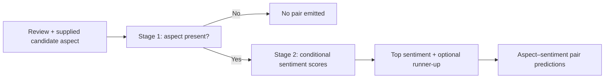

# Generalising aspect–sentiment models to unseen aspects

**Where does transfer fail: detecting the aspect, or predicting its sentiment?**

[](https://github.com/jl701/msc-project-chattermill-topic-classification/actions/workflows/quality.yml)
[](https://www.python.org/downloads/release/python-3110/)
[](#licensing-and-publication-scope)

Research code for a UCL MSc dissertation developed with Chattermill. The project
studies customer feedback when a business introduces a reporting category for
which the model has no task-specific labelled training examples.

> “The app kept crashing, although the support agent was very helpful.”
>
> Desired output: **App/website → negative**, **Staff attitude → positive**.

The model receives the candidate aspect names, optionally with definitions. It
must decide which are present and assign sentiment to those it detects. An
unmentioned candidate should receive no prediction. The task is classification
within a supplied taxonomy, rather than discovering new category names.

[Results](#what-the-study-found) · [Quick start](#try-it-without-a-gpu) ·
[Reproduction guide](docs/reproducibility.md) · [Code guide](docs/architecture.md) ·
[Contributing](CONTRIBUTING.md) · [Evidence index](docs/README.md) ·
[Public release boundary](docs/github_upload_scope.md)

## What the study found

On FABSA's twelve aspect hold-outs, **few-shot Qwen provides the stronger
thresholded aspect detector, while QLoRA provides the stronger conditional
sentiment predictor**. A fixed composition assigns each model to its stronger
stage. It improves the registered average endpoint over both complete systems
on the locked official evaluation.

| System | Official held-out pair F1 |
|---|---:|
| Few-shot detection + QLoRA sentiment | **0.5075** |
| Complete frozen Qwen few-shot | 0.4954 |
| Complete QLoRA | 0.4864 |

**What this number measures:** aspect–sentiment pair micro-F1 for the held-out
aspect in each fold, averaged equally across twelve aspects. These results use
aspect names plus minimal definitions and 1,587 official-test reviews. They are
not overall F1 across familiar and unseen aspects.

The paired gain over few-shot is **+0.0121 [0.0014, 0.0224]**. The gated comparison
with QLoRA is **+0.0211 [0.0002, 0.0411]**. These modest gains support complementary
stage capabilities. The QLoRA contrast changes sign when App/website is omitted,
and the evidence alone does not establish that operating both components is
worth the deployment cost. None of the three systems exactly recovered both
sentiments in the 21 gold cases with two sentiments.

[Exact official contrasts](docs/thesis_figure_data/taxonomy_final_test_v1/official_confirmatory_results.csv)
· [All official methods and conditions](docs/thesis_figure_data/taxonomy_final_test_v1/official_l2_model_condition_summary.csv)
· [Interpretation and limitations](docs/results.md)

### Does training-data construction change the finding?

The original protocol removes any training review annotated with the held-out
aspect. A later validation study retains these reviews but excludes **all
supervision for that aspect**, including negative training targets. It asks how
the result changes when historical text and labels for other aspects remain
available.

| System | Reviews removed | Reviews retained, held-out supervision masked |
|---|---:|---:|
| Frozen Qwen few-shot | 0.5052 | 0.4730 |
| QLoRA | 0.4801 | 0.4722 |
| Fixed composition, using each policy's own components | **0.5261** | **0.5004** |

These are **validation-only robustness results**, proposed after the original
official test. Absolute performance changes, but stage complementarity persists
on this average endpoint. Few-shot examples were selected from each policy's
training pool, so that contrast also includes a change in demonstrations.

[Completed policy evidence](docs/results/training_policy_completed/README.md)
· [Training and sampling explained](docs/methods.md)

## How the system works



The composition uses few-shot scores and its threshold for Stage 1, then QLoRA
sentiment scores and its runner-up threshold for Stage 2. There is no learned
router or per-review model selection. QLoRA uses **one shared adapter per fold
model**, trained on both prompt types, and is queried separately for each stage.

The broader study compares TF–IDF, frozen E5, description-to-classifier weight
transfer, DistilBERT, Qwen zero-shot, Qwen few-shot and QLoRA. Matched TF–IDF/E5
controls examine one-stage versus two-stage factorisation. Other studies cover
description wording and three parent-group hold-outs.

## Try it without a GPU

Use **Python 3.11** for the documented development environment. From a checkout:

```bash
git clone https://github.com/jl701/msc-project-chattermill-topic-classification.git
cd msc-project-chattermill-topic-classification
python -m venv .venv
```

Activate the environment:

```bash
# macOS / Linux
source .venv/bin/activate
```

```powershell
# Windows PowerShell
.venv\Scripts\Activate.ps1
```

Then install and run:

```bash
python -m pip install -e .
taxonomy-demo
taxonomy-results
```

`taxonomy-demo` uses **synthetic reviews and hand-written example scores** to
exercise the actual policy transformation, candidate grid, decoder and evaluator.
It shows that filtering removes the mixed review, masking retains it without
held-out targets, and an absent aspect produces no prediction. It downloads no
model and is not a model-performance benchmark.

`taxonomy-results` displays the two result tables above from checked-in aggregate
CSV evidence. It does not read raw reviews, open test labels or rerun inference.
Run it from the repository root, or supply `--repo-root /path/to/checkout`.

The equivalent module commands are `python -m msc_project.demo` and
`python -m msc_project.reporting`. Both accept `--help` and an optional new
`--output` file. Existing output files are protected from accidental overwrite.

## Reproduce at the level you need

| Goal | Requirements | Start here |
|---|---|---|
| Understand policy construction and decoding | CPU, core Python dependencies | `taxonomy-demo` |
| Display the reported headline tables | Checked-in aggregate CSVs | `taxonomy-results` |
| Test the implementation | Development dependencies, optional neural dependencies for the full suite | [Contributor guide](CONTRIBUTING.md) |
| Rebuild score-level analysis | Original score bundles and corresponding manifests | [Reproduction guide](docs/reproducibility.md) |
| Repeat model training/inference | FABSA export, model access, compatible GPU environment | [Reproduction guide](docs/reproducibility.md) |

Raw reviews, trained adapters, score shards and cloud backups are not distributed
in this checkout. Aggregate tables are sufficient to inspect reported results,
but not to independently recompute every result. Obtain FABSA from its
[dataset publisher](https://huggingface.co/datasets/jordiclive/FABSA) and follow
the publisher's terms. The reproduction guide distinguishes recorded execution
environments from the lightweight installation above.

## Read the code

| Question | Implementation |
|---|---|
| How are reviews filtered and labels masked? | [`taxonomy_training_policy_sensitivity.py`](src/msc_project/experiments/taxonomy_training_policy_sensitivity.py) |
| How are QLoRA training examples sampled? | [`taxonomy_two_stage_training.py`](src/msc_project/experiments/taxonomy_two_stage_training.py) |
| What are the exact Qwen prompts? | [`qwen_two_stage_classifier.py`](src/msc_project/llm/qwen_two_stage_classifier.py) |
| How are scores decoded and thresholds selected? | [`taxonomy_two_stage.py`](src/msc_project/experiments/taxonomy_two_stage.py) |
| How is review-cluster resampling implemented? | [`resampling.py`](src/msc_project/evaluation/resampling.py) for the policy study, [`taxonomy_final_test_analysis.py`](src/msc_project/experiments/taxonomy_final_test_analysis.py) for the official test |
| Where are the important tests? | [Test and architecture map](docs/architecture.md) |

`src/` contains reusable code, `scripts/` experiment entry points, `configs/`
registered resources, `tests/` executable checks and `docs/` results and guides.
[Historical experiments](docs/history.md) retain their context without defining
the current project direction.

## Project and dissertation

**From Supplied Candidates to Evolving Taxonomies: Generalising Fine-grained
Aspect-Based Sentiment Models to Unseen Aspects** — Jialin Liu, UCL MSc Data
Science and Machine Learning. Academic supervisor: Professor Lewis Griffin.
Industry supervisor: Dr Aji Ghose, Chattermill.

The thesis remains under author review and its manuscript is not distributed in
the current public tree. The evidence index provides the public scientific
record, including aggregate results and the historical execution revisions.

## Licensing and publication scope

This is research software. No project-wide redistribution licence has yet been
granted, so public visibility does not imply permission to copy, modify or
redistribute the code. Dataset and model licences are separate. For attribution,
include the dissertation title, author and the repository commit you used.

The public tree deliberately excludes raw reviews, row-level predictions,
checkpoints, adapters, credentials, cloud endpoints, private supervision notes
and the working dissertation manuscript. See the
[public release boundary](docs/github_upload_scope.md) and
[security policy](.github/SECURITY.md).
